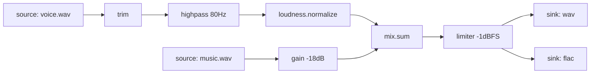

# 10. CLI interaction model and graph planning roadmap

## Purpose

This document records the intended next CLI shape for Auralis and the
development path from the current SoX-ng-compatible effect-chain surface toward
a modern, typed, plannable audio pipeline system.

The core decision is to expose three user-facing interaction layers while
compiling all of them into one internal graph/planner/executor path:

```text
Recipe aliases  -> Typed Spec -> Graph IR -> Execution Plan -> Executor
Linear chains   -> Typed Spec -> Graph IR -> Execution Plan -> Executor
Graph specs     -> Typed Spec -> Graph IR -> Execution Plan -> Executor
```

The design goal is not to create three execution systems. It is to let users
pay the right cognitive cost for the task while keeping Auralis internally
typed, inspectable, optimizable, and reproducible.

## Product principle

Auralis should distinguish what the user is trying to express:

| Layer | User intent | User says | Optimized cost |
| --- | --- | --- | --- |
| Recipe | Result | "Make this output" | Cognitive cost |
| Linear chain | Ordered transforms | "Process this stream in this order" | Expression cost |
| Graph spec | Dependencies | "This is a maintainable DAG" | Maintenance cost |

This is a better boundary than "simple versus complex" because complexity is
not stable. A long single-input effect chain may still be linear and suitable
for argv. A small voice-plus-music mix already has fan-in and may need node
names, targets, cache boundaries, and multi-output sharing.

Rules of thumb:

- Use recipes when the user wants a common result and does not care about the
  internal pipeline.
- Use `render --fx` or `render --chain` when the user wants one ordered audio
  stream.
- Use `Auralis.toml` when the pipeline has multiple inputs, multiple outputs,
  named intermediate results, fan-in, fan-out, cache needs, CI needs, or long
  maintenance lifetime.

## Current compatibility position

The repository already has a substantial SoX-ng-style command/effect chain
surface. That work should remain valuable as:

- A compatibility surface.
- A golden-oracle migration path.
- A source of effect semantics and typed effect implementations.
- A bridge into the future op registry.

It should not define the long-term primary CLI shape.

Preferred future compatibility forms:

```bash
auralis legacy sox input.wav output.wav gain -3 reverse
auralis render input.wav -o output.wav --sox 'gain -3 reverse'
auralis import sox --input input.wav --output output.wav --effects 'gain -3 reverse' --export Auralis.toml
```

The current `auralis run input.wav output.wav gain -3 ...` path can remain
during migration, but new documentation and new functionality should move
toward `convert`, `render`, `plan`, `run`, `graph`, and `explain`.

## Target command surface

Primary commands:

```text
auralis convert     Simple format conversion.
auralis render      Single-input or small-input ordered DSP rendering.
auralis pipe        One-line exploratory pipeline expression.
auralis run         Run Auralis.toml, a pipeline spec, a target, or a plan.
auralis plan        Preview execution, cache actions, barriers, and outputs.
auralis check       Validate specs, parameters, graph structure, and locking.
auralis graph       Emit DAG as mermaid, dot, svg, or json.
auralis explain     Explain why a node or target runs and what depends on it.
auralis inspect     Inspect audio files, artifacts, or node outputs.
auralis ops         List available ops and expose op schema/examples.
auralis fmt         Format graph specs.
auralis init        Create an Auralis.toml project scaffold.
auralis cache       Inspect and manage content-addressed cache state.
```

The most important near-term commands are:

```bash
auralis render ...
auralis plan ...
auralis run ...
auralis graph ...
```

## Layer 1: recipe aliases

Recipes are intent-level shortcuts. They compile into the same graph IR as all
other commands, but the user does not need to know that.

Examples:

```bash
auralis convert input.wav -o output.flac

auralis convert input.wav -o output.wav \
  --container wav \
  --sample pcm24 \
  --rate 48k \
  --channels stereo

auralis trim input.wav 10s..30s -o clip.wav

auralis normalize input.wav -o normalized.wav --peak -1dBFS

auralis loudnorm input.wav -o podcast.wav \
  --target -16LUFS \
  --true-peak -1dBTP

auralis mix voice.wav music.wav -o master.wav \
  --gain voice=0dB \
  --gain music=-14dB

auralis batch 'input/**/*.wav' \
  --to 'build/{dir}/{stem}.flac' \
  --rate 48k \
  --channels stereo
```

Recipes must be inspectable:

```bash
auralis plan convert input.wav -o output.flac
auralis convert input.wav -o output.flac --export Auralis.toml
```

Implementation rule: recipes lower to typed specs, not directly to DSP calls.

## Layer 2: linear chain

`render` is for ordered transforms on one primary stream. Ordered effects use
`--fx`, one effect per shell string:

```bash
auralis render input.wav -o output.wav \
  --fx 'trim 10s..30s' \
  --fx 'gain -3dB' \
  --fx 'fade out=500ms' \
  --rate 48k \
  --sample pcm24
```

Important boundary:

- `--fx` describes ordered DSP nodes.
- `--rate`, `--sample`, `--channels`, and output format flags describe output
  boundary policy.

Do not convert ordered effects into unordered flags such as `--gain` and
`--trim`. Effect order is semantically observable:

```text
gain -> norm != norm -> gain
```

A compact chain form may exist for hand-written exploration:

```bash
auralis render input.wav -o output.wav \
  --chain 'trim 10s..30s | gain -3dB | fade out=500ms'
```

Complex chains should be exportable:

```bash
auralis render input.wav -o output.wav \
  --chain 'trim 10s..30s | gain -3dB | fade out=500ms' \
  --export Auralis.toml
```

Implementation rule: `--fx` and `--chain` parse into typed op configs as early
as possible. Do not carry long-lived untyped command strings.

## Layer 3: graph spec

Complex project state belongs in `Auralis.toml`, not argv.

Common commands:

```bash
auralis run Auralis.toml
auralis run Auralis.toml#master
auralis run --target master
auralis plan Auralis.toml#master
auralis graph Auralis.toml --format svg -o graph.svg
auralis explain Auralis.toml#master vocal_clean
```

Graph specs are for:

- Multiple inputs.
- Multiple outputs.
- Named nodes.
- Branching and fan-in/fan-out.
- Shared upstream work.
- Cache policy.
- Batch processing.
- CI and locked reproducibility.
- Plan, graph, and explain workflows.

## Auralis Graph Spec v1

Default file name:

```text
Auralis.toml
```

Header:

```toml
version = "auralis.graph/v1"
name = "podcast-episode-42"

[defaults]
backend = "auto"        # auto | scalar | simd
cache = "smart"         # off | smart | full
block = "65536f"        # frames per processing block
```

Sources:

```toml
[[sources]]
id = "voice"
path = "input/voice.wav"

[[sources]]
id = "music"
path = "input/music.wav"
```

Sources expose default ports:

```text
voice.audio
music.audio
```

Linear chain sugar:

```toml
[[chains]]
id = "voice_clean"
input = "voice.audio"

steps = [
  { op = "trim", range = "0s..180s" },
  { op = "filter.highpass", cutoff = "80Hz" },
  { op = "gain", by = "-3dB" },
  { op = "loudness.normalize", target = "-16LUFS", true_peak = "-1dBTP" },
]
```

If step IDs are omitted, Auralis should generate stable IDs:

```text
voice_clean/01-trim
voice_clean/02-filter.highpass
voice_clean/03-gain
voice_clean/04-loudness.normalize
```

Explicit step IDs are allowed:

```toml
steps = [
  { id = "cut_intro", op = "trim", range = "12s..180s" },
  { id = "remove_rumble", op = "filter.highpass", cutoff = "80Hz" },
]
```

Graph nodes:

```toml
[[nodes]]
id = "bed"
op = "gain"
input = "music.audio"
by = "-14dB"

[[nodes]]
id = "mix"
op = "mix.sum"

inputs = [
  { from = "voice_clean.audio", gain = "0dB" },
  { from = "bed.audio", gain = "0dB" },
]

[[nodes]]
id = "master"
op = "limiter"
input = "mix.audio"
ceiling = "-1dBFS"
```

Sinks:

```toml
[[sinks]]
id = "master_wav"
input = "master.audio"
path = "build/episode42.wav"

format = {
  container = "wav",
  sample = "pcm24",
  sample_rate = "48k",
  channels = "stereo"
}
```

Multi-output graphs must share upstream computation:

```toml
[[sinks]]
id = "master_flac"
input = "master.audio"
path = "build/episode42.flac"

format = {
  container = "flac",
  sample = "pcm16",
  sample_rate = "48k",
  channels = "stereo"
}

[[sinks]]
id = "preview"
input = "master.audio"
path = "build/episode42-preview.wav"

format = {
  container = "wav",
  sample = "pcm16",
  sample_rate = "16k",
  channels = "mono"
}
```

The executor should not rerun `voice -> clean -> mix -> master` for each sink.
Downmixing and resampling for preview should happen only on the preview branch.

## Complete graph spec example

```toml
version = "auralis.graph/v1"
name = "podcast-episode-42"

[defaults]
backend = "auto"
cache = "smart"
block = "65536f"

[[sources]]
id = "voice"
path = "input/voice.wav"

[[sources]]
id = "music"
path = "input/music.wav"

[[chains]]
id = "voice_clean"
input = "voice.audio"

steps = [
  { id = "cut", op = "trim", range = "5s..185s" },
  { id = "rumble", op = "filter.highpass", cutoff = "80Hz", q = 0.707 },
  { id = "level", op = "loudness.normalize", target = "-16LUFS", true_peak = "-1dBTP" },
]

[[nodes]]
id = "music_bed"
op = "gain"
input = "music.audio"
by = "-18dB"

[[nodes]]
id = "mix"
op = "mix.sum"

inputs = [
  { from = "voice_clean.audio", gain = "0dB" },
  { from = "music_bed.audio", gain = "0dB" },
]

[[nodes]]
id = "master"
op = "limiter"
input = "mix.audio"
ceiling = "-1dBFS"

[[sinks]]
id = "wav"
input = "master.audio"
path = "build/episode42.wav"

format = {
  container = "wav",
  sample = "pcm24",
  sample_rate = "48k",
  channels = "stereo"
}

[[sinks]]
id = "flac"
input = "master.audio"
path = "build/episode42.flac"

format = {
  container = "flac",
  sample = "pcm16",
  sample_rate = "48k",
  channels = "stereo"
}
```

## Plan output contract

`plan` is a first-class UX surface. Before execution, users should be able to
see:

- Files that will be read.
- Files that will be written.
- Nodes that will run.
- Nodes that are cache-clean.
- Whole-buffer barriers.
- Streaming segments.
- Fanout points.
- Estimated memory pressure.
- Warnings and diagnostics.

Example:

```text
Pipeline: podcast-episode-42
Target: flac

Inputs:
  voice  input/voice.wav    wav pcm24 48k stereo
  music  input/music.wav    wav pcm16 48k stereo

Outputs:
  flac   build/episode42.flac  flac pcm16 48k stereo

Graph:
  nodes: 8
  edges: 8
  streaming segments: 3
  whole-buffer barriers: 1
  fanout points: 1

Execution:
  S1  voice.read -> trim -> highpass
      mode: streaming
      block: 65536 frames

  B1  loudness analysis
      mode: whole-buffer scan
      reason: loudness.normalize requires integrated analysis

  S2  loudness apply -> mix.input[0]
      mode: streaming

  S3  music.read -> gain -> mix.input[1]
      mode: streaming

  S4  mix -> limiter -> flac.encode
      mode: streaming

Cache:
  voice_clean: dirty
    reason: input/voice.wav changed
  music_bed: clean
  master: dirty
    reason: upstream voice_clean dirty

Will write:
  build/episode42.flac

Estimated peak memory:
  38 MiB streaming
  412 MiB if loudness analysis materializes full buffer

Warnings:
  none
```

`auralis plan --json` must expose the same information for CI and tooling.

## Explain output contract

`explain` answers why a node or target will execute and what it affects.

Example:

```text
Node: voice_clean
Kind: chain
Input:
  voice.audio

Expanded nodes:
  voice_clean/cut
  voice_clean/rumble
  voice_clean/level

Why dirty:
  input/voice.wav mtime changed
  cached hash missing for voice_clean/level

Execution mode:
  cut       streaming
  rumble    streaming
  level     analysis + streaming apply

Downstream:
  mix
  master
  flac

Suggested optimization:
  loudness.normalize introduces a full-file analysis pass.
  If peak normalization is sufficient, use norm.peak to reduce analysis cost.
```

## Graph output contract

`graph` should support at least:

```bash
auralis graph Auralis.toml --format mermaid
auralis graph Auralis.toml --format dot -o graph.dot
auralis graph Auralis.toml --format svg -o graph.svg
auralis graph Auralis.toml --format json -o graph.json
```

Mermaid example:



## Ops registry UX

Users should not need long-form documentation to discover op syntax.

```bash
auralis ops
auralis ops gain
auralis ops gain --schema json
```

Human output for one op should include:

- Purpose.
- Inputs.
- Outputs.
- Parameters and accepted units.
- Streaming capability.
- Whole-buffer behavior.
- CLI examples.
- TOML examples.

The same typed registry should drive:

- CLI help.
- Spec schema.
- Diagnostics.
- Documentation.
- AI/tool generation.
- Compatibility alias resolution.

## Parameter and unit syntax

The user-facing syntax should accept natural units and immediately lower them
to typed values.

Time:

```text
10s
250ms
1:23.5
44100f
start
end
```

Ranges:

```text
10s..30s
..30s
10s..
start..end
0f..44100f
```

Frequency:

```text
80Hz
12kHz
0.5nyquist
```

Gain:

```text
-3dB
+6dB
0.5x
```

Sample rate:

```text
44.1k
48k
96000
```

Channels:

```text
mono
stereo
2
6
```

CLI effect syntax:

```bash
--fx 'trim 10s..30s'
--fx 'gain -3dB'
--fx 'fade in=50ms out=500ms curve=linear'
--fx 'filter.highpass cutoff=80Hz q=0.707'
```

TOML should prefer named parameters:

```toml
{ op = "trim", range = "10s..30s" }
{ op = "gain", by = "-3dB" }
{ op = "fade", fade_in = "50ms", fade_out = "500ms", curve = "linear" }
{ op = "filter.highpass", cutoff = "80Hz", q = 0.707 }
```

## Execution model

The compiler pipeline should be:

```text
CLI argv / Auralis.toml / pipe expression
        -> Parse
        -> Typed Spec
        -> Normalize
        -> Graph IR
        -> Validate
        -> Optimize
        -> Execution Plan
        -> Streaming Executor
```

Every op must declare capabilities:

```rust
pub struct OpCapabilities {
    pub streaming: bool,
    pub requires_full_buffer: bool,
    pub latency_frames: u64,
    pub tail_frames: Option<u64>,
    pub preserves_sample_rate: bool,
    pub preserves_channels: bool,
    pub deterministic: bool,
    pub cache_worthy: bool,
}
```

Capability examples:

| Op | Streaming | Whole-buffer | Note |
| --- | ---: | ---: | --- |
| `gain` | yes | no | Fusion candidate |
| `dcshift` | yes | no | Fusion candidate |
| `filter.highpass` | yes | no | Stateful streaming |
| `trim` | yes | no | Changes frame range |
| `fade` | yes | no | Needs position awareness |
| `reverse` | no | yes | Must materialize |
| `norm.peak` | partial | scan | Scan peak, then apply |
| `loudness.normalize` | partial | analysis | Analyze, then apply |
| `mix.sum` | yes | no | Multi-input sync |
| `stat` | yes | no | Analyzer sink |

## Segment fusion and barriers

Continuous streaming ops should fuse into a single segment:

```text
read -> trim -> gain -> highpass -> fade -> write
```

The executor should operate like:

```text
decode block
  -> trim adapter
  -> gain kernel
  -> highpass state
  -> fade kernel
  -> encode block
```

It should not write intermediate files or allocate full buffers between every
effect unless a capability requires it.

Whole-buffer barriers must be explicit in `plan`:

```text
Barrier:
  node: reverse
  reason: requires full buffer
  estimated memory: 412 MiB
```

## Cache policy

Default cache policy should vary by context:

| Context | Default |
| --- | --- |
| One-shot CLI | `off` |
| `Auralis.toml` run | `smart` |
| CI or release | `full` or `locked` |

User controls:

```bash
auralis run Auralis.toml --cache off
auralis run Auralis.toml --cache smart
auralis run Auralis.toml --cache full
```

Cache modes:

| Mode | Behavior |
| --- | --- |
| `off` | Do not read or write persistent cache. |
| `smart` | Cache expensive nodes, fanout nodes, and nodes after whole-buffer barriers. |
| `full` | Cache every deterministic cache-worthy node. |

Cache keys should include:

- Input content hash.
- Op name.
- Op parameters.
- Auralis version.
- Op implementation version.
- Backend selection.
- Sample format.
- Sample rate.
- Channel layout.
- Deterministic seed.

BLAKE3 is the preferred content hash candidate.

## Batch processing

CLI batch:

```bash
auralis batch 'samples/**/*.wav' \
  --to 'build/{dir}/{stem}.flac' \
  --fx 'trim 0s..10s' \
  --fx 'gain -3dB' \
  --rate 48k \
  --jobs auto
```

Spec batch:

```toml
version = "auralis.graph/v1"
name = "sample-pack-normalize"

[[batches]]
id = "samples"
glob = "samples/**/*.wav"
to = "build/{dir}/{stem}.flac"
jobs = "auto"

steps = [
  { op = "trim", range = "0s..10s" },
  { op = "norm.peak", target = "-1dBFS" },
]

format = {
  container = "flac",
  sample = "pcm16",
  sample_rate = "48k",
  channels = "stereo"
}
```

Plan output for batches should summarize:

```text
Batch: samples
Matched files: 184
Already clean: 139
Will render: 45
Jobs: 8
Estimated writes: 45
```

## Diagnostics

Errors must point to source locations when a spec is involved.

Example:

```text
error[auralis::spec::unknown_input]: unknown input port `voic.audio`

  ┌─ Auralis.toml:31:9
  │
31│ input = "voic.audio"
  │         ^^^^^^^^^^^ did you mean `voice.audio`?

help:
  available ports:
    voice.audio
    music.audio
```

`miette` is the preferred diagnostics candidate. Diagnostics should be stable
enough for snapshot tests.

## Machine-readable output

All inspection and planning commands must expose machine-readable output:

```bash
auralis plan Auralis.toml --json
auralis inspect input.wav --json
auralis graph Auralis.toml --format json
auralis ops gain --schema json
```

Default human output should remain concise.

## Project layout

Recommended project layout:

```text
my-audio-project/
├── Auralis.toml
├── Auralis.lock
├── input/
│   ├── voice.wav
│   └── music.wav
├── build/
│   ├── episode42.wav
│   └── episode42.flac
└── .auralis/
    ├── cache/
    ├── plans/
    └── reports/
```

`Auralis.lock` should record:

- Resolved op names.
- Op implementation versions.
- Format decisions.
- Backend decisions.
- Cache-relevant semantic hashes.

Locked commands:

```bash
auralis check --locked
auralis plan --locked
auralis run --locked
```

## Rust workspace direction

Current crates should be preserved where possible. The long-term architecture
should move toward these responsibilities:

```text
crates/
  auralis-core        Basic typed vocabulary.
  auralis-codec       Decode/encode boundary.
  auralis-dsp         DSP primitive kernels.
  auralis-effects     Effect implementations and compatibility parsing.
  auralis-spec        TOML/JSON spec structs and schema.
  auralis-ir          Canonical graph IR.
  auralis-plan        Validation, lowering, optimization, and scheduling.
  auralis-exec        Streaming executor and cache integration.
  auralis-cache       Content-addressed artifact cache.
  auralis-cli         Clap wrapper and diagnostics rendering.
  auralis-testkit     Golden, snapshot, property, and planner tests.
```

`auralis-cli` should not know DSP internals. It should:

- Parse argv.
- Load specs.
- Call the planner.
- Call the executor.
- Render diagnostics and reports.

## Spec type sketch

```rust
#[derive(Debug, Clone, Serialize, Deserialize, JsonSchema)]
pub struct GraphSpec {
    pub version: SpecVersion,
    pub name: Option<String>,
    #[serde(default)]
    pub defaults: Defaults,
    #[serde(default)]
    pub sources: Vec<SourceSpec>,
    #[serde(default)]
    pub chains: Vec<ChainSpec>,
    #[serde(default)]
    pub nodes: Vec<NodeSpec>,
    #[serde(default)]
    pub sinks: Vec<SinkSpec>,
    #[serde(default)]
    pub batches: Vec<BatchSpec>,
}
```

Node sketch:

```rust
#[derive(Debug, Clone, Serialize, Deserialize, JsonSchema)]
#[serde(tag = "op", rename_all = "kebab-case")]
pub enum NodeSpec {
    #[serde(rename = "gain")]
    Gain {
        id: NodeId,
        input: PortRef,
        by: GainValue,
    },

    #[serde(rename = "filter.highpass")]
    HighPass {
        id: NodeId,
        input: PortRef,
        cutoff: Frequency,
        q: Option<f32>,
    },

    #[serde(rename = "mix.sum")]
    MixSum {
        id: NodeId,
        inputs: Vec<MixInputSpec>,
    },
}
```

## Op descriptor sketch

```rust
pub trait AudioOp: Send + Sync + 'static {
    type Config: Serialize + for<'de> Deserialize<'de>;

    fn name(&self) -> &'static str;
    fn schema(&self) -> OpSchema;
    fn capabilities(&self, config: &Self::Config) -> OpCapabilities;
    fn compile(&self, config: Self::Config, ctx: &CompileCtx) -> Result<CompiledOp>;
}
```

Registry descriptor:

```rust
pub struct OpDescriptor {
    pub name: &'static str,
    pub aliases: &'static [&'static str],
    pub category: OpCategory,
    pub inputs: &'static [PortDescriptor],
    pub outputs: &'static [PortDescriptor],
    pub capabilities: OpCapabilities,
    pub examples: &'static [&'static str],
}
```

## Graph IR and planner sketch

```rust
pub struct GraphIr {
    pub nodes: StableGraph<NodeIr, EdgeIr>,
    pub ids: HashMap<NodeId, NodeIndex>,
    pub targets: HashMap<TargetId, NodeIndex>,
}
```

```rust
pub struct ExecutionPlan {
    pub segments: Vec<ExecutionSegment>,
    pub barriers: Vec<Barrier>,
    pub cache_actions: Vec<CacheAction>,
    pub outputs: Vec<OutputAction>,
    pub diagnostics: Vec<Diagnostic>,
}
```

```rust
pub enum ExecutionSegment {
    Streaming {
        id: SegmentId,
        nodes: Vec<NodeId>,
        inputs: Vec<PortRef>,
        outputs: Vec<PortRef>,
        block_frames: u64,
    },

    WholeBuffer {
        id: SegmentId,
        node: NodeId,
        reason: BarrierReason,
    },

    Encode {
        id: SegmentId,
        sink: SinkId,
    },
}
```

## Candidate dependencies

These are candidates, not locked decisions:

| Area | Candidate |
| --- | --- |
| CLI parser | `clap`, `clap_complete`, `clap_mangen` |
| Spec serde | `serde`, `toml`, `serde_json` |
| Schema | `schemars` |
| Graph | `petgraph` |
| Parallelism | `rayon` |
| Diagnostics | `miette` |
| Progress | `indicatif` |
| Hash/cache | `blake3` |
| Glob batch | `globset` |
| UTF-8 paths | `camino` |
| Unit typing | Custom newtypes first; evaluate `uom` later |
| Pipe parser | `chumsky` or `winnow` |
| Tracing | `tracing` |
| Temp files | `tempfile` |
| CLI tests | `assert_cmd`, `insta` |

Prefer custom lightweight newtypes for units at first unless the dimension
system becomes broad enough to justify `uom`.

## Implementation phases

### Phase 1: Modern CLI shell over existing capability

Goal: keep current DSP and compatibility behavior while introducing the new
surface.

Implement:

- `auralis render input.wav -o output.wav --fx ...`
- `auralis convert input.wav -o output.flac`
- `auralis ops`
- `auralis check`

Allowed internal implementation:

- Lower to existing `EffectChain` and `Pipeline`.
- Reuse existing typed effect command parser where practical.
- Keep current `auralis run input.wav output.wav ...` as compatibility.

Acceptance:

- A user can perform format conversion without knowing graph/spec concepts.
- A user can perform an ordered DSP chain without SoX-style positional argv.
- `ops` lists implemented effects from a typed registry.

### Phase 2: Spec, IR, and planner skeleton

Goal: support graph specs and inspectable planning without full optimization.

Implement:

- `auralis-spec`
- `auralis-ir`
- `auralis-plan`
- `auralis check Auralis.toml`
- `auralis plan Auralis.toml`
- `auralis run Auralis.toml`
- `auralis graph Auralis.toml --format mermaid|dot|json`

Initial planner can be simple:

```text
parse -> validate -> lower -> topological order -> execute
```

Acceptance:

- Spec parse errors produce source-aware diagnostics.
- Unknown ports and duplicate IDs are reported with actionable messages.
- Linear chain sugar expands to stable node IDs.
- Multi-output specs do not require duplicate user-authored pipelines.

### Phase 3: Execution optimization

Goal: make graph planning materially improve performance and reuse.

Implement:

- Streaming segment fusion.
- Whole-buffer barrier planning.
- Multi-output sharing.
- Smart cache mode.
- Batch jobs.
- `auralis explain`.

Acceptance:

- `plan` reports streaming segments and barriers.
- `reverse`, peak normalization, and loudness normalization show barriers or
  analysis passes explicitly.
- Shared upstream computation is planned once for multiple outputs.
- Cache-clean nodes are skipped in `smart` and `full` modes.

### Phase 4: Developer and CI experience

Goal: make the system pleasant to automate and maintain.

Implement:

- `auralis ops --schema json`
- `auralis fmt`
- Shell completions.
- Man pages.
- Miette diagnostics across spec and CLI parser surfaces.
- Snapshot tests for human output.
- `Auralis.lock`
- `check --locked`, `plan --locked`, `run --locked`

Acceptance:

- CI can run `fmt --check`, `check --locked`, `plan --json`, and `run`.
- Human output is snapshot-tested.
- JSON output is schema-stable enough for downstream tools.

## Non-goals for the first implementation

- Do not build a full optimizer before the spec and planner skeleton exist.
- Do not force all users into `Auralis.toml`.
- Do not encode complex DAGs directly into argv.
- Do not make SoX-ng positional syntax the primary future CLI.
- Do not default persistent cache on for one-shot commands.
- Do not introduce external codec process dependencies as part of this CLI work.

## Open design questions

- Whether `auralis plan convert ...` should be a global wrapper form or whether
  recipes should accept `--plan`.
- Whether `render` should allow more than one primary input before requiring
  graph spec.
- Exact boundary between `mix` recipe and graph spec for named multi-input
  mixes.
- Whether `pipe` should ship before or after graph specs.
- Whether `Auralis.lock` should lock backend auto-selection by host class or by
  exact backend.
- Whether cache keys should include source file mtime as a fast path in
  addition to content hash.

## Design summary

Auralis should feel like a simple audio command for simple work and a
verifiable audio build system for complex work:

```text
Recipe      = result abstraction
Linear chain = order abstraction
Graph spec   = dependency abstraction
```

All three surfaces must converge into one typed graph/planning/execution model.
That is the mechanism that keeps the CLI approachable without giving up
streaming fusion, barrier visibility, cacheability, multi-output sharing,
diagnostics, and reproducibility.
